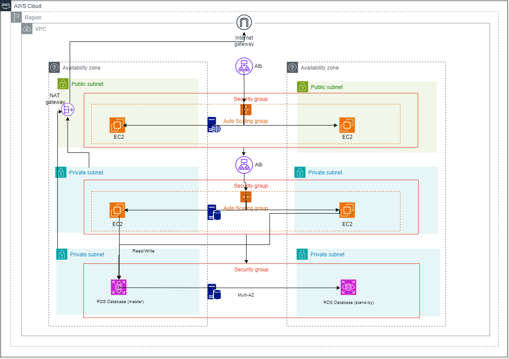

# Cloud Three-Tier Architecture Deployment using Terraform

This repository contains the Terraform code for deploying a three-tier architecture on AWS cloud. The architecture consists of three layers: Presentation layer, Application layer, and Data layer. It leverages various AWS services including ALB (Application Load Balancer), ASG (Auto Scaling Group), VPC (Virtual Private Cloud) and its components, EC2 (Elastic Compute Cloud), CloudWatch for monitoring, and RDS (Relational Database Service).
  

## Architecture Overview

The three-tier architecture is structured as follows:

1. **Presentation Layer**: This layer serves as the entry point for users and includes the Application Load Balancer (ALB) to distribute incoming traffic among multiple instances.

2. **Application Layer**: The application logic resides in this layer, deployed on EC2 instances within Auto Scaling Groups (ASG). ASG ensures high availability and scalability by automatically adjusting the number of instances based on demand.

3. **Data Layer**: This layer manages the storage and retrieval of data. It includes Amazon RDS, a managed relational database service, providing scalable and reliable databases.
   
  

  

## Terraform Modules

The Terraform code is organized into modules for better maintainability and reusability:

1. **VPC Module**: Defines the Virtual Private Cloud (VPC), including subnets, route tables, and internet gateway, providing network isolation and security.

2. **ALB Module**: Configures the Application Load Balancer, sets up listeners and target groups to route traffic to EC2 instances in the Application layer.

3. **ASG Module**: Creates the Auto Scaling Group, defining launch configurations, scaling policies, and health checks for EC2 instances.

4. **EC2 Module**: Defines individual EC2 instances with specified configurations, such as instance type, AMI, and security groups.

5. **RDS Module**: Sets up the Relational Database Service, configuring database engine, instance type, storage, and backup options.
  

## Usage

To ensure smooth deployment of the three-tier architecture with Terraform, begin by cloning the repository using the command git clone <repository-url>. It's essential to have AWS credentials set up with appropriate permissions for accessing cloud resources. After cloning, initialize Terraform in the project directory by executing terraform init.

Before proceeding with deployment, it's advisable to execute terraform plan to preview the changes Terraform will enact. This step provides a detailed overview of the actions Terraform intends to take, including any resource creations, modifications, or deletions. Reviewing the plan ensures transparency and helps prevent unintended changes to the environment.

Once you've reviewed and customized the variables in the terraform.tfvars file or provided values via command-line arguments, proceed with deploying the infrastructure using terraform apply. Upon completion of the deployment process, users can access the application through the provided Application Load Balancer (ALB) DNS name. This DNS name serves as the entry point for users, facilitating seamless usage and navigation of the deployed architecture.
  

## Monitoring

CloudWatch serves as the primary tool for both monitoring and logging activities. Through CloudWatch, operators gain access to crucial performance metrics, including CPU utilization, network traffic, and database performance, allowing for real-time monitoring of system health. These metrics can be easily accessed and analyzed either through the intuitive AWS Management Console or programmatically using CloudWatch APIs, providing flexibility in monitoring and facilitating proactive management of the infrastructure.
  

## Contributing

Contributions are encouraged and valued for this project! Whether it's suggesting improvements, reporting bugs, or submitting code changes, feel free to engage by opening issues or pull requests. Your contributions play a vital role in enhancing the project's functionality and overall quality.
  

## License

This project is released under the permissive MIT License, granting users the freedom to use, modify, and distribute the software for any purpose. The MIT License ensures minimal restrictions on usage, fostering collaboration and adoption within the community.

